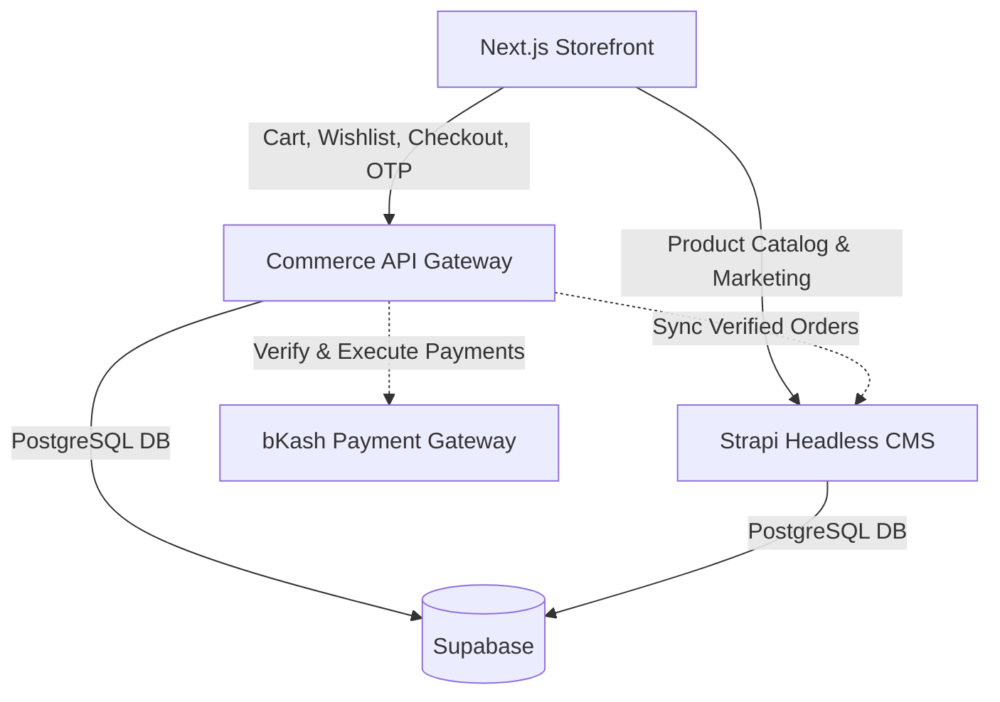

# Premium Storefront — Editorial Edition

A full-stack, headless, and CMS-driven e-commerce platform designed with a dark, premium aesthetic. This project showcases modern API design, secure payment integrations, headless content management, and aggressive server-side performance caching.

## 🚀 Tech Stack

- **Frontend:** Next.js 14, React 18, Server Components, CSS Modules (Vanilla CSS, no tailwind to maintain custom micro-animations).
- **Backend (CMS):** Strapi v4 (Headless content, Products, Blogs, Pages, Orders).
- **Backend (Gateway layer):** Express.js / Node.js (Payment processing, Wishlist caching, OTP mailing).
- **Database:** PostgreSQL (Hosted via Supabase).
- **Payments:** bKash API & Cash on Delivery.

## 🏗 Architecture

This platform utilizes a robust dual-backend setup to separate heavy content fetching from high-throughput transactional states.

## ✨ Features

- **Auth-Gated Cart & Wishlist:** Fully secure transactional architecture managed inside the Express DB layer.
- **Dynamic SEO & Indexing:** 100% automated `sitemap.xml`, `robots.txt`, open-graph tags, and canonical loops using Strapi webhooks & Next.js dynamic metadata.
- **bKash Native Checkout:** Tokenized, backend-verified payments preventing frontend manipulation.
- **Editorial CMS Design:** Fully customized Strapi admin styling and brand translations.
- **Scalable Filter Engine:** Query-param-mapped product sorting, search, and stock filtration that runs completely Server-Side.
- **Static Aggressive Caching:** Next.js Incremental Static Regeneration (ISR) ensures blazing fast LCP metrics, clearing caches automatically upon Strapi `publish` webhooks.

## 🔑 Environment Secrets (Keys Only)

Below are the Environment Variable keys required. **Never commit the actual values to GitHub.**

### Next.js (`frontend/.env.local`)
- `NEXT_PUBLIC_STRAPI_URL`
- `NEXT_PUBLIC_COMMERCE_API_URL`
- `STRAPI_API_TOKEN`
- `REVALIDATION_SECRET`

### Express Gateway (`commerce-api/.env`)
- `DATABASE_URL`
- `PORT`
- `ADMIN_API_KEY`
- `BKASH_USERNAME`
- `BKASH_PASSWORD`
- `BKASH_APP_KEY`
- `BKASH_APP_SECRET`

### Strapi CMS (`backend/.env`)
- `HOST`, `PORT`, `APP_KEYS`, `API_TOKEN_SALT`, `ADMIN_JWT_SECRET`, `TRANSFER_TOKEN_SALT`
- `DATABASE_URL`

## 💳 Payment Architecture Security

For maximum security, this project leverages an intermediary API gateway:

1. Next.js creates the cart payload.
2. The payload is offloaded to the Express Node.js gateway (`/api/v1/checkout/bkash/create`).
3. Express generates a secure token and hits the bKash API using server-side hidden `APP_KEYS`.
4. bKash returns the URL to Next.js.
5. Post-completion, bKash hits back into Express (`/api/v1/checkout/bkash/execute`) which safely finalizes the logic and writes the secure Order to Strapi.

## 🗺 Phase 4 Roadmap
- **Traffic Elasticity:** Integrate Meilisearch locally to lift searching weight off Postgres.
- **Delivery Integration:** Implement Pathao courier webhooks for realtime tracking IDs.
- **Data & Metrics:** Implement full GA4 Datalayer tracking funnel (ViewItem -> AddToCart -> Purchase).
- **Scale Testing:** Run a 1,000+ VU concurrent load-test simulating holiday peaks.
